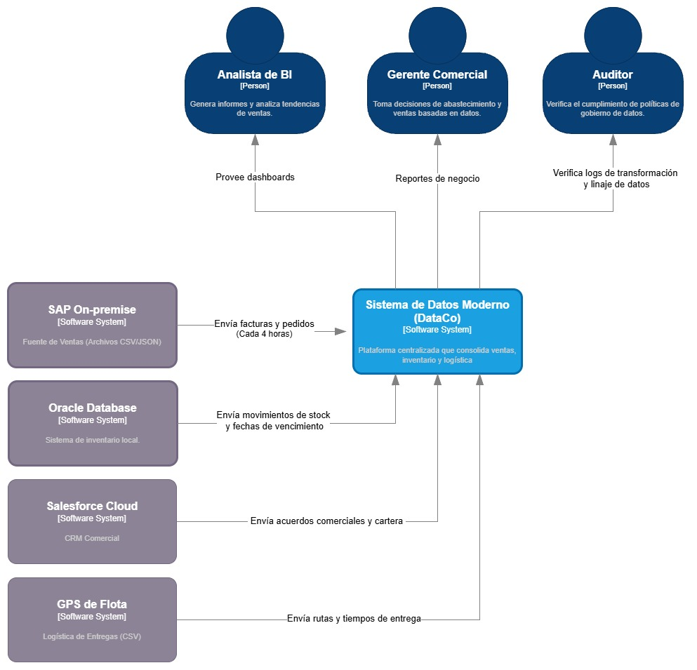
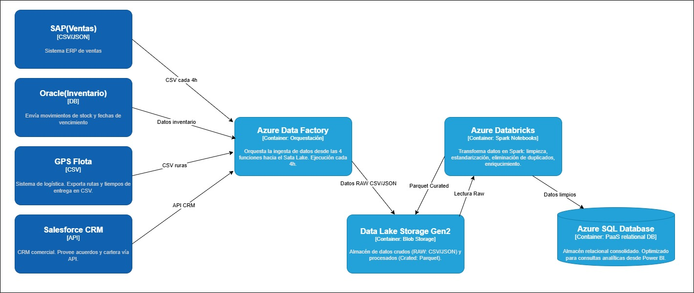
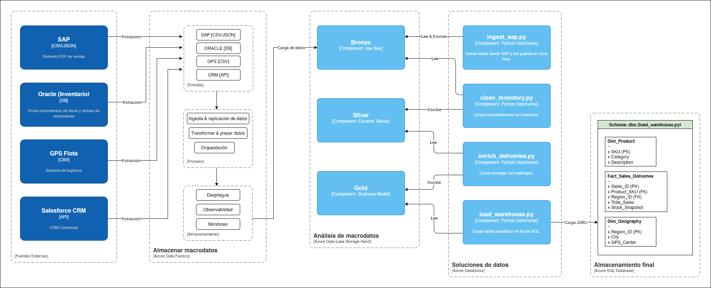

# Análisis de la Arquitectura de DataCo

---

## Equipo de Trabajo
* Viviana Moreno Sierra
* Dayana Valbuena Torres
* Juan Felipe González Cano
* Hazly Jhoana Larrea Castillo

---

## Tabla de Contenido
1. [Contexto del Proyecto](#1-contexto-del-proyecto)
2. [Modelo C4](#2-modelo-c4)
   * [Diagrama C1 - Contexto](#diagrama-c1---contexto)
   * [Diagrama C2 - Contenedores](#diagrama-c2---contenedores)
   * [Diagrama C3 - Componentes](#diagrama-c3---componentes)
3. [Decisiones Arquitectónicas (ADRs)](#3-decisiones-arquitectónicas-adrs)
4. [Evidencias de Implementación](#4-evidencias-de-implementación)

---

## 1. Contexto del Proyecto
Diseño e implementación de un pipeline de datos en Azure para **DataCo**, una empresa de consumo masivo. El objetivo principal es integrar datos fragmentados de cuatro sistemas aislados (SAP, Oracle, GPS y Salesforce) en un único modelo de datos, reduciendo el ciclo de reportes de 3-5 días a un máximo de 4 horas.

---

## 2. Modelo C4

### Diagrama C1 - Contexto
El Diagrama de Contexto describe el ecosistema de datos de **DataCo**, mostrando cómo la solución propuesta interactúa con las fuentes de información existentes y los usuarios finales.

**Interacciones Clave:**
* **Sistemas Externos (Fuentes):** Se ingesta información de SAP (Ventas), Oracle (Inventario), Salesforce (CRM) y GPS (Logística).
* **Herramienta de Salida:** El sistema entrega datos procesados a **Power BI Desktop**.
* **Usuarios Finales:** El Analista de BI y el Gerente Comercial acceden a dashboards para la toma de decisiones.
* **Gobierno:** El Auditor supervisa la trazabilidad y calidad de los datos directamente en el sistema central.

---
### Diagrama C2 - Contenedores
Este diagrama muestra la arquitectura de datos de DataCo en Azure, detallando los contenedores principales y su interacción:

* **Fuentes externas:**

  * SAP (Ventas) – exporta facturas y pedidos en CSV/JSON cada 4h.
  * Oracle (Inventario) – envía movimientos de stock y fechas de vencimiento.
  * GPS Flota – exporta rutas y tiempos de entrega en CSV.
  * Salesforce CRM – provee acuerdos y cartera vía API cada 4h.

* **Azure Data Factory:** Orquesta la ingesta de datos desde las cuatro fuentes hacia el Data Lake, con ejecución programada cada 4h.
* **Data Lake Storage Gen2:** Almacenamiento de datos crudos (RAW: CSV/JSON) y procesados (Curated: Parquet).

* **Azure Databricks:** Realiza limpieza, estandarización, eliminación de duplicados y enriquecimiento de datos usando Spark.

* **Azure SQL Database:** Almacén relacional consolidado, optimizado para consultas analíticas.

---
### Diagrama C3 - Componentes
El propósito de este diagrama es mostrar la estructura interna de un contenedor, identificando sus componentes principales, responsabilidades y las relaciones entre ellos, así como sus dependencias con otros sistemas o bases de datos.

Azure Data Factory:

Actúa como el núcleo de orquestación y almacenamiento de macrodatos en esta arquitectura, gestionando el ciclo de vida completo del dato desde su origen. Este componente se encarga de la ingesta y replicación automatizada de datos, centralizándolos en un entorno escalable.

Azure Data Lake Storage Gen2: Repositorio central de archivos y datos, organizado en capas:
* Bronze: Datos crudos o sin procesar.
* Silver: Datos limpios y estructurados.
* Gold: Datos refinados y listos para consumo de negocio.

Azure Databricks Workspace:
* ingest_sap.py: Notebook encargado de extraer información desde SAP y almacenarla en la capa inicial del Data Lake.
* clean_inventory.py: Notebook que depura y estandariza los datos de inventario, corrigiendo inconsistencias y preparando la información para siguientes etapas.
* enrich_deliveries.py: Notebook que complementa los datos de entregas con reglas de negocio, catálogos u otras fuentes adicionales.
* load_warehouse.py: Notebook responsable de cargar la información final procesada hacia la base de datos analítica.

Azure SQL Database: Base de datos relacional donde se almacenan los datos consolidados para consultas, reportes e indicadores.
