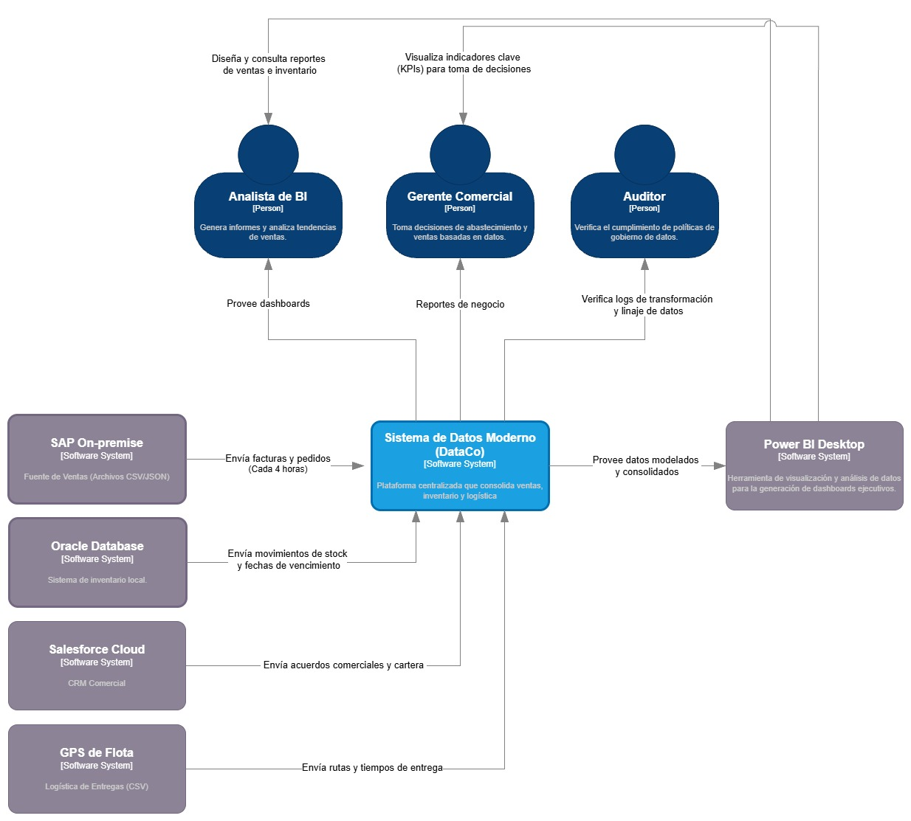

# Caso # 2 - Pipeline de Datos en la Nube

**Tecnológico de Antioquia - Institución Universitaria** **Curso:** Computación en la Nube | Semestre 2026-1  
**Profesor:** Julian David Florez Sanchez  

---

## Equipo de Trabajo
* Viviana Moreno Sierra
* Dayana Valbuena Torres
* Juan Felipe González Cano
* Hazly Jhoana Larrea Castillo

---

## Tabla de Contenido
1. [Contexto del Proyecto](#1-contexto-del-proyecto)
2. [Modelo C4](#2-modelo-c4)
   * [Diagrama C1 - Contexto](#diagrama-c1---contexto)
   * [Diagrama C2 - Contenedores](#diagrama-c2---contenedores)
   * [Diagrama C3 - Componentes](#diagrama-c3---componentes)
3. [Decisiones Arquitectónicas (ADRs)](#3-decisiones-arquitectónicas-adrs)
4. [Evidencias de Implementación](#4-evidencias-de-implementación)

---

## 1. Contexto del Proyecto
Diseño e implementación de un pipeline de datos en Azure para **DataCo**, una empresa de consumo masivo. El objetivo principal es integrar datos fragmentados de cuatro sistemas aislados (SAP, Oracle, GPS y Salesforce) en un único modelo de datos, reduciendo el ciclo de reportes de 3-5 días a un máximo de 4 horas.

---

## 2. Modelo C4

### Diagrama C1 - Contexto
El Diagrama de Contexto describe el ecosistema de datos de **DataCo**, mostrando cómo la solución propuesta interactúa con las fuentes de información existentes y los usuarios finales.

**Interacciones Clave:**
* **Sistemas Externos (Fuentes):** Se ingesta información de SAP (Ventas), Oracle (Inventario), Salesforce (CRM) y GPS (Logística).
* **Herramienta de Salida:** El sistema entrega datos procesados a **Power BI Desktop**.
* **Usuarios Finales:** El Analista de BI y el Gerente Comercial acceden a dashboards para la toma de decisiones.
* **Gobierno:** El Auditor supervisa la trazabilidad y calidad de los datos directamente en el sistema central.

---
